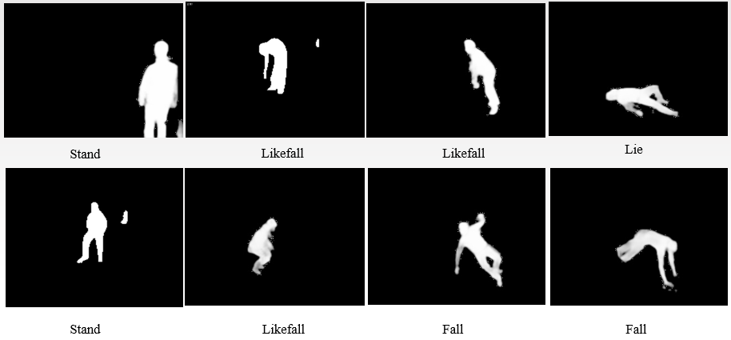

# Fall_Detection_image_dataset

List of free/public domain datasets with image data for use in the Fall Detection field. Most stuff here is just raw image data, if you are looking for annotated and processed dataset, I provide a Human-Body-Segmentation-Fall dataset here based on Le2i dataset and SisFall dataset with a download link. If you think it helpful, PLEASE refer to the sources at the bottom.

## Recommend Datasets

- [Le2i - Laboratoire Electronique, Informatique et Image](Le2i - Laboratoire Electronique, Informatique et Image) [**1**]. A dataset contains four scenes: Home(60 videos), Coffee room(70 videos), Office(64 videos), Lecture room(27 videos). Only Home and Coffee room subset have 'Annotation_files', which describe the frame number of the beginning and end of the fall. FORMAT: 320x240 25FPS. High quality. Single person. A large-volume dataset.
- [SisFall: A Fall and Movement Dataset](http://sistemic.udea.edu.co/en/investigacion/proyectos/english-falls/) **[2]**.  A dataset contains two categories: ADL(19 videos), Fall(15 videos). This dataset consists of 34 videos and 4,510 files(both image and sensor data), each file with a single activity. FORMAT: 1440x1080. High quality. Single person.  A large-diverse dataset.

## Other Datasets

- [Link](http://videodatasets.org/). Video Datasets website links to a number of video datasets used for computer vision research.
  - [Fall Detection Dataset (FDD)](http://le2i.cnrs.fr/Fall-detection-Dataset?lang=en), CNRS
  - [Multicam Fall Dataset](http://www.iro.umontreal.ca/~labimage/Dataset/), U. Montreal
  - [UR Fall Detection Dataset](http://fenix.univ.rzeszow.pl/~mkepski/ds/uf.html) (URFD)
- [HIGH QUALITY FALL SIMULATION DATA](https://iiw.kuleuven.be/onderzoek/advise/datasets). A dataset recorded with 2D camera's containing both highly realistic fall and ADL scenarios. The dataset was recorded in a nursing home setting by re-enacting actual falls that were observed in nursing home residents.
- [TST FALL DETECTION DATASET V2](https://ieee-dataport.org/documents/tst-fall-detection-dataset-v2). The dataset contains depth frames and skeleton joints collected using Microsoft Kinect v2 and acceleration samples provided by an IMU during the simulation of ADLs and falls.

## Human-Body-Segmentation-Fall dataset

This dataset[3] is reprocessed by the author himself. The original dataset is based on the  partial Le2i dataset and SisFall dataset. The author cut out the videos of ADL(daily activities) and fall actions into pictures through the OpenCV library, and then sent the pictures to the human segmentation neural network to get the pictures with only the foreground of the human body, and then processed all the pictures by binarization and morphological corrosion and expansion.

The dataset provided by the author is divided into two parts. Each dataset is divided into five folders, representing five categories. Blank represented the situation where there was no person, Fall represented the situation where there was a fall, Likefall represented the situation where the center of gravity was unstable, Lie represented the situation when the body was lying, and Stand represented the situation when the body was standing. The figure and pictures of the dataset are as follows. Please note that this dataset complies with the GNU license. Please refer to the source of this dataset when using.

| figure(per 16 frames) | Le2i-processed | SisFall-processed |
| --------------------- | -------------- | ----------------- |
| Blank                 | 7              | 7                 |
| Fall                  | 68             | 15                |
| Likefall              | 83             | 13                |
| Lie                   | 11             | 17                |
| Stand                 | 84             | 9                 |
| sum                   | 253            | 61                |

Download:(please wait. Later I will upload.)

| Dataset           | Google         | BaiduDisk      |
| ----------------- | -------------- | -------------- |
| Le2i-processed    | [29.0MB](Link) | [29.0MB](Link) |
| SisFall-processed | [30.2MB](Link) | [30.2MB](Link) |

## Reference

[1] I. Charfi, J. Miteran, J. Dubois, M. Atri and R. Tourki, “Optimised spatio-temporal descriptors for real-time fall detection: comparison of SVM and Adaboost based classification,” *J. Electron. Imaging* *(JEI)*, vol. 22, no. 4, pp. 17, October 2013.

[2] A. Sucerquia, J. D. López, J. F. Vargas-Bonilla, “SisFall: a fall and movement dataset,” *Sensors*, vol. 17, no. 12, pp. 198, 2017.

[3] Y. Yang, Q. Hu, M. Dai, H. Yan, J. Ling, "Design and Implementation of Fall Detection System Based on Video," *Int. Conf. on Comput. Eng. & App. (ICCEA)*, Guangzhou, 2020, on press.